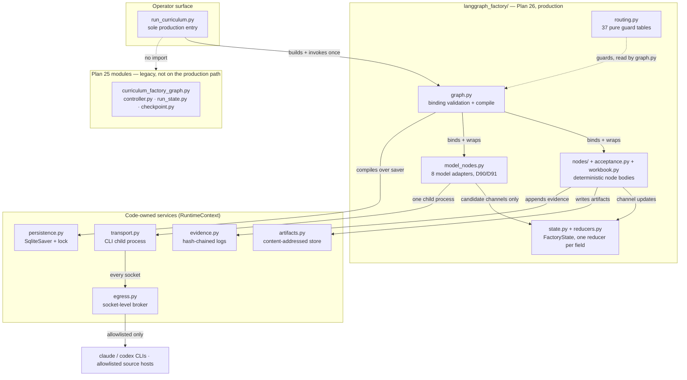
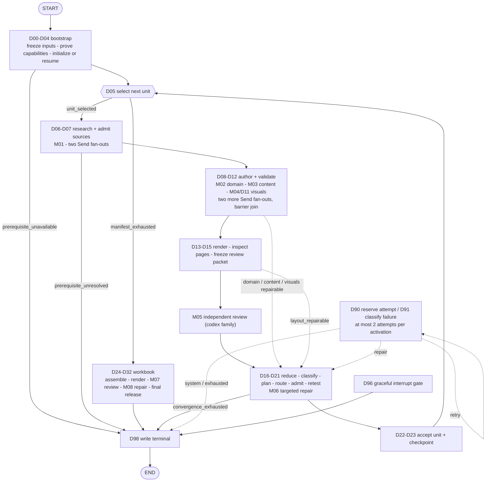

# curriculum_factory — architecture and operations guide

> **Audience:** maintainers of `src/curriculum_factory/`, design reviewers, and authorized operators running the factory locally.
> **Evidence basis:** repository at git `a0694ea` (dirty worktree), inspected 2026-08-17. Source code, prompts, packaging and policy files read directly. The graph was compiled and the test suite executed on this machine. **No deployed environment and no completed production factory run were inspected.**
> **Invalidated by:** any change to `src/curriculum_factory/langgraph_factory/graph.py`, `routing.py`, `state.py`, `unit_graph.py`, `acceptance.py`, `workbook.py`, or `src/curriculum_factory/config/model_jobs.v1.yaml` — those decide the topology, the state contract and the model routes this guide describes. The graph digest recorded in [§13](#13-limitations-and-verification) is the cheapest way to detect that.

Evidence labels used throughout: **[observed]** — demonstrated by an execution on this machine; **[declared]** — stated by code, config or policy that was read but not executed; **[inferred]** — follows from inspected evidence but is neither stated nor executed; **[unknown]** — evidence absent or insufficient.

---

## 1. Purpose and boundary

curriculum_factory produces printable curriculum units (and an assembled workbook) from **one supplied manifest** plus **one curriculum's own domain rules**, using large language models for authoring and review while keeping every decision that matters — admission, routing, acceptance, termination — in deterministic Python. **[declared]** (`readme.md`, `pyproject.toml` description, `src/curriculum_factory/langgraph_factory/graph.py` module docstring.)

**Actors.** A human operator invokes the CLI. Two model CLIs (`claude`, `codex`) are invoked as child processes. Primary-source web hosts are read, through one allowlisted retriever. There is no server, no API, and no multi-user surface. **[declared]** (`run_curriculum.py`, `egress.py`.)

**Owns:** unit manifest interpretation, source research and admission, domain-data and content authoring, visual generation, PDF rendering and page inspection, independent review, targeted repair, unit acceptance, workbook assembly, and the terminal ledger with its exit code.

**Does not own:** the curriculum content rules (they live in `curricula/<name>/`, outside the installed package), the model CLIs themselves, or any hosting. It writes **only** below the `--output-root` given to it. **[declared]** (`run_curriculum.py`, `artifacts.py` containment.)

**Entry:** exactly one production entry point —

```
python3 -m curriculum_factory.run_curriculum --engine-root PATH --curriculum PATH --output-root PATH
        (--preflight | --unit UNIT_ID | --all | --resume) [--authorization PATH]
```

console-scripted as `curriculum-factory-run-curriculum`. **[observed]** — `--preflight` was run successfully during this inspection (see [§13](#13-limitations-and-verification)).

**Exit:** one JSON object on stdout and an exit code mapped from the terminal kind. **[declared]** (`run_curriculum.py:TERMINAL_EXIT_CODES`.)

| Terminal kind | Exit | Meaning |
|---|---|---|
| `UNIT_ACCEPTED` | 0 | The requested unit was accepted. |
| `COMPLETE` | 0 | The full manifest completed. |
| `INTERRUPTED` | 10 | A graceful stop was observed at a node boundary. |
| `PAUSED_PREREQUISITE` | 11 | A prerequisite is unresolved; operator action needed. |
| `CONVERGENCE_EXHAUSTED` | 12 | Repair attempts were exhausted without acceptance. |
| `SYSTEM_FAILURE` | 20 | A classified system fault. Also the exit for a CLI-level failure. |
| — | 2 | Argument error. |
| — | 3 | Another process holds the output-root execution lock. **[declared]** (`persistence.LOCK_LOSER_EXIT_CODE`.) |

**Assumptions.** Python 3.13.x; POSIX (`fcntl` locking, process groups, signal handling); `pandoc`, `typst` and the Poppler tools present; `claude` and `codex` installed and **subscription-authenticated**, not API-key authenticated. **[declared]** + **[observed]** on this machine.

**Explicitly out of scope for this guide:** the curricula content under `curricula/`, the repo-refactor tooling under `tests/refactor_repo/` and `plans_internal/`, and the `docs/`-level governance material.

---

## 2. Architecture

The system is one Python package with **two engine generations present in the same tree**, only one of which the production CLI reaches.



*Diagram — Component composition. Takeaway: everything the production CLI executes flows through the compiled Plan 26 graph, and every external reach is funnelled through one transport and one egress broker. Scope: import structure of `src/curriculum_factory/`. Evidence: **[declared]** from imports and module docstrings; the dotted "no import" edge is **[observed]** — a `grep` for `curriculum_factory_graph` finds it referenced only by tests and by its own module.*

**Text equivalent.** `run_curriculum.py` builds and invokes the compiled graph in `langgraph_factory/graph.py`. That graph executes deterministic node bodies (`nodes/`, `acceptance.py`, `workbook.py`) and eight model adapters (`model_nodes.py`), all reading and writing one typed `FactoryState` whose merges are fixed by `reducers.py`. Routing decisions come from pure functions in `routing.py`, which the builder wires as conditional edges. Nodes reach the outside world only through services opened once per invocation into a `RuntimeContext`: the artifact store, the evidence log, the model transport, the egress broker, the checkpoint saver. The Plan 25 modules (`curriculum_factory_graph.py`, `controller.py`, `run_state.py`, `checkpoint.py`) implement an earlier non-LangGraph engine and are not imported by the production entry point.

**Trust boundaries.** Three, all crossed only in one direction through one module each: (1) **process boundary** — model CLIs are child processes spawned by `transport.py` in a disposable sandboxed workspace; (2) **network boundary** — `egress.py` intercepts `socket.socket` itself, so *every* network path in the process is brokered, and only `SourceRetriever` is permitted to open HTTPS; (3) **filesystem boundary** — `artifacts.py` resolves every write inside `--output-root` and rejects path escape. **[declared]**

**Dependencies.** `langgraph==1.2.9`, `langgraph-checkpoint-sqlite==3.1.0`, `jsonschema==4.26.0`, `PyYAML==6.0.3`, `Pillow==12.2.0`; Python `>=3.13,<3.14`. All pinned exactly. **[declared]** (`pyproject.toml`.)

**A finding, not a fact about intent.** Two engine generations coexist. `run_curriculum.py`'s docstring calls itself "the sole production entry"; the package's own `__init__.py` still exports the Plan 25 `CurriculumRuntime`, and three other console scripts (`session_bridge`, `capability_cycle`, `finalize_evidence`) exist whose relationship to the Plan 26 graph was **not** established during this inspection. Treat the Plan 25 modules as legacy on the evidence available, but do not delete them on the strength of this guide alone. **[inferred]**

---

## 3. Graph behavior

**The graph is framework-defined, not prompt-orchestrated.** Every edge is registered in Python before compilation and every branch is decided by a pure function of persisted state. No model output selects a destination. `routing.py`'s docstring states the rule and `state.py` enforces it structurally: the `RuntimeContext` handed to nodes *cannot* contain a model client or a routing authority — `RuntimeContextViolation` is raised at construction for a field named `model`, `llm`, `router`, `routing_authority` and others. **[declared]**

**[observed]** The graph compiles: `build_curriculum_factory_graph()` returned a `CompiledStateGraph` named `plan26_curriculum_factory` with **50 nodes** (48 bindings plus `START`/`END`) and **158 edges** (153 conditional, 5 normal). Graph digest `0e1eca87080aa102…`.



*Diagram — Execution structure at stage level. Takeaway: one forward spine (bootstrap → per-unit loop → review → repair → acceptance → workbook → terminal), with every repairable finding converging on the repair cycle (dotted) and every ending converging on one terminal writer. Scope: **stages, not nodes** — the 48 nodes are grouped, and the full node-by-node route table is [§6](#6-route-contracts), which is the precise artifact; drawing all 158 edges was tried first and produced an unreadable page. Evidence: **[declared]** from `graph.SKELETON_BRANCHES`, `unit_graph.UNIT_BRANCHES`, `acceptance`, `workbook` and `routing.GUARD_DESTINATIONS`; node and edge **counts** are **[observed]** from the compiled graph. Nothing in the picture is asserted that those tables do not state.*

**Text equivalent and the parts the diagram omits.**

- **Entry.** `START → D00_BOOTSTRAP_EPISODE`, which routes three ways: `fresh`, `resume`, or `recover_orphan` (straight to the interrupt gate).
- **Fan-out / fan-in.** Four guards are `Send`-based map/reduce dispatchers: `D06`, `D06B`, `D10`, `D12`. Workers return through `union_disjoint` on a `RecordMap` channel and the **barrier**, never a worker, decides what happens next. `unit_graph.py` refuses to invent a `Send` projection: where a dispatching node staged no denominator, the fan-out guard raises rather than improvising a projection nothing committed to. **[declared]**
- **Model attempts.** Every model node is preceded by `D90_RESERVE_MODEL_ATTEMPT` and, on failure, classified by `D91_CLASSIFY_MODEL_FAILURE` → `retry` (back to D90), `repair` (to D17), or `system`/`exhausted` (to D98). The attempt limit is **2** — one original activation plus at most one D91-authorized retry. **[declared]** (`model_nodes.MODEL_NODE_ATTEMPT_LIMIT`.)
- **Loops and their bounds.** Three cycles exist: `D90 ↔ D91` (bounded by the attempt limit), `D16 → D17 → D18 → D19 → D20 → D21 → D16` (bounded by `attempt_counters` and terminating in `CONVERGENCE_EXHAUSTED` at D17), and the per-unit loop `D23 → D05` (bounded by the manifest). No unbounded cycle was found. **[inferred]** from the guard tables and the exhaustion destinations; not exercised.
- **Termination.** Exactly one node writes a terminal (`D98_WRITE_TERMINAL`) and exactly one edge reaches `END`. Failure takes precedence over interruption by design: an episode that broke *and* was asked to stop is recorded as the failure, so the fault is not hidden behind `INTERRUPTED`. **[declared]** (`routing.py` docstring.)
- **Human handoff.** `PAUSED_PREREQUISITE` (via `D30`) and `INTERRUPTED` (via `D96`) are the two terminals that hand control back to a person.
- **Build-time refusals.** The builder rejects a binding that is missing, uncallable, duplicated, sourced outside the five permitted node modules, or whose name or body carries a placeholder marker (`stub`, `mock`, `TODO: implement`, …); and it rejects a registered node that is neither wired nor declared deferred in `DEFERRED_TOPOLOGY`. "The graph compiled" therefore cannot mean "the graph compiled against a stand-in". **[declared]**, and **[observed]** to the extent that the real build passes all of it.

---

## 4. Node and tool contracts

48 node bodies: 22 in the deterministic catalogue, 8 unit-repair/acceptance, 8 workbook, 8 model adapters, plus `D90`/`D91` bookkeeping. **[observed]** from `full_binding_inventory()`.

Every deterministic node carries a frozen `NodeSpec` catalogue row naming its **inputs**, **outputs**, **failure classes** and **guards**, and is handed only the state fields that row authorizes — structural isolation, so execution adjacency grants no context. A node that reads or writes an unauthorized channel raises `CatalogueViolation`. **[declared]** (`nodes/__init__.py`.) Example row, verbatim:

```
NodeSpec(node_id='D08_VALIDATE_DOMAIN', module='domain',
  inputs=('selected_unit_id','effective_run','artifact_versions','artifact_heads',
          'source_admissions','engine_root','run_id','episode_id'),
  outputs=('artifact_versions','artifact_heads','deterministic_checks','pending_packet'),
  failure_classes=('system',), guards=('domain_admitted','domain_repairable'))
```

**Model nodes.** Eight jobs, each pinned to a CLI, model, reasoning effort and timeout. **[declared]** (`src/curriculum_factory/config/model_jobs.v1.yaml`, read via `transport.load_job_registry()`.)

| Job | CLI | Model | Effort | Timeout |
|---|---|---|---|---|
| M01 research unit sources | claude | claude-sonnet-5 | xhigh | 900 s |
| M02 create unit domain data | claude | claude-sonnet-5 | high | 900 s |
| M03 write unit content | claude | claude-sonnet-5 | high | 900 s |
| M04 create unit visuals | claude | claude-sonnet-5 | high | 900 s |
| M05 review actual unit | **codex** | gpt-5.6-sol | xhigh | 900 s |
| M06 repair named unit artifact | claude | claude-sonnet-5 | xhigh | 900 s |
| M07 review actual workbook | **codex** | gpt-5.6-sol | xhigh | 900 s |
| M08 repair named workbook defect | claude | claude-sonnet-5 | xhigh | 900 s |

Authoring runs on the Anthropic family; **review runs on a different family (OpenAI/codex)**, so a unit is never reviewed by the family that wrote it. **[declared]**

A model adapter is deliberately thin: prove a D90 reservation exists, materialize exactly one authorized projection, invoke the transport once, validate the structured candidate, return a **pre-admission** update. A model node can never admit, merge, route, accept, resume or terminate — it may write only ten candidate channels (`artifact_versions`, `source_discoveries`, `source_interpretations`, `visual_results`, `unit_reviews`, `workbook_versions`, `workbook_reviews`, `activation_receipts`, `model_execution_receipts`, `pending_failure`). Heads, receipts and terminals are code-owned. **[declared]**

**Side effects to know about.** Model nodes spawn a child process in a disposable workspace under an OS sandbox and append an egress receipt. `D13`/`D26` invoke `pandoc`/`typst` and rasterize with Poppler. `D23` and the terminal writer append to the hash-chained evidence logs and to the SQLite checkpoint. A retried node therefore repeats its child process and its receipts, but artifact admission is idempotent by a deterministic key derived from the artifact identity, not from the node that proved it. **[declared]** (`graph._persist_admitted_head_updates`.)

**Failure semantics.** Expected failures are classified into `pending_failure` inside the node. Unexpected exceptions deliberately propagate to the common node boundary in `graph.py`, which converts them to a classified `SYSTEM_FAILURE` candidate — a node that swallowed an unknown error would let the episode continue on unproven state. LangGraph's own `GraphBubbleUp` is re-raised untouched. **[declared]**

---

## 5. State and data

`FactoryState` is a `TypedDict` of **~90 channels**, each declaring **exactly one reducer** via `Annotated`; `state.py` fails at import if any field declares zero or two. **[declared]**

| Reducer | Semantics | Representative channels |
|---|---|---|
| `write_once` | First write wins; a conflicting second write raises. | `run_id`, `frozen_digest`, `effective_run`, `episode_id` |
| `append_unique` | Append if the correlation key is new; a differing duplicate raises. | `artifact_versions`, `route_decisions`, `unit_reviews` |
| `append_unique_by(...)` | Same, on an explicit key tuple. | `deterministic_checks` (scope, owner, head_hash, check_id, attempt) |
| `union_disjoint` | Map union; an overlapping key raises. **This is the fan-in channel type.** | `source_discoveries`, `retrievals`, `visual_results` |
| `advance_head` | Head pointer may only advance along a parent chain. | `artifact_heads`, `workbook_head` |
| `monotonic_max` / `monotonic_status` | Counters never regress; status transitions are one-way. | `cursor`, `attempt_counters`, `unit_status` |
| `accept_once` | A unit may be accepted once. | `accepted_unit_receipts` |
| `write_episode_terminal_once` | One terminal per episode. | `terminal` |

Reducers are pure `(existing, new) → merged` with no clock, no filesystem and no ordering dependence, and **fail closed**: a violation raises a typed `ReducerError` rather than dropping, coercing or best-effort merging. **[declared]** (`reducers.py`.)

**Persistence has two independent layers.** Losing one does not silently lose the other. **[declared]**

1. **LangGraph checkpoints** — `<output_root>/.langgraph/checkpoints.sqlite3` via `SqliteSaver`, thread id derived from the immutable `run_id` (`<run_id>:episode:<n>`, recovery threads `<run_id>:recover:<n>`), empty checkpoint namespace.
2. **Product evidence** — `<output_root>/evidence/*.jsonl`: `events`, `activations`, `routes`, `executions`, `checkpoints`, `index`. Append-only and **hash-chained**: each record carries a monotonic ordinal and a hash over its own canonical bytes plus its predecessor's, so deletion, insertion, reorder and byte-level tampering are all detectable by recomputation from `GENESIS_HASH`.

Artifacts themselves are content-addressed and immutable in `artifacts.py`: staging plus atomic admission, version/parent chains, head pointers, and accepted bytes written read-only (`0444` files, `0555` directories). Path escape from the output root is rejected. **[declared]**

**`RuntimeContext` is never persisted.** It is a frozen dataclass of opened services, never checkpointed and never serialized, and it structurally cannot hold a model client or a routing authority. **[declared]**

**Redaction and retention: [unknown].** No retention policy, no expiry and no redaction rule for the evidence logs or the artifact store was found in the inspected sources. Everything written under an output root appears to persist until deleted by hand. Operators should assume the evidence logs contain the full text of admitted source excerpts and generated content.

---

## 6. Route contracts

`routing.py` holds **37 guard tables** mapping a node to its permitted destinations. Every guard is a total, pure function of persisted state: it reads no service, no clock, no filesystem and no model result body. An undeclared guard value raises `RoutingViolation` rather than resolving to a terminal — a value outside the frozen table means the guard table and the node body disagree, which is a *build* defect, and laundering it into `SYSTEM_FAILURE` would report the run as broken when the build is. `assert_guard_table_total()` is called by the builder so that defect fails compilation. **[declared]**

Two rules apply before any node-specific rule, in order: a classified `pending_failure` routes to the terminal writer (to `D91` first for a model node); a graceful interrupt observed at a node boundary routes to `D96`. **[declared]**

Selected routes — the ones an operator or reviewer will actually need. **[declared]** from `GUARD_DESTINATIONS`:

| From | Guard value | To | Notes |
|---|---|---|---|
| `D00_BOOTSTRAP_EPISODE` | `fresh` / `resume` / `recover_orphan` | D01 / D00R / D96 | The three ways an episode can begin. |
| `D03_PROVE_CAPABILITIES` | `prerequisite_unavailable` | D98 | Missing tool ⇒ terminal, not a degraded run. |
| `D05_SELECT_NEXT_UNIT` | `unit_selected` / `manifest_exhausted` | D06 / D24 | The manifest bound on the outer loop. |
| `D07_CORRELATE_AND_ADMIT_SOURCES` | `prerequisite_unresolved` | D30 → D98 | `PAUSED_PREREQUISITE`; needs a person. |
| `D08` / `D09` / `D12` / `D14` | `*_repairable` | **D17** | The four validation back-edges into repair. |
| `D17_CLASSIFY_UNIT_FINDINGS` | `convergence_exhausted` | D98 | Where repair gives up honestly. |
| `D19_ROUTE_UNIT_REPAIR` | `model_repair` / `deterministic_repair` | D90(→M06) / D20 | Deterministic repair skips the model entirely. |
| `D90_RESERVE_MODEL_ATTEMPT` | `exhausted` | D98 | Attempt budget spent. |
| `D91_CLASSIFY_MODEL_FAILURE` | `retry` / `repair` / `system` / `exhausted` | D90 / D17 / D98 / D98 | Retry authorized only for a malformed/transient transport class. |
| `D92_REENTER_VALIDATED_FRONTIER` | `incomplete_model_activation` | D91 | A resumed model activation is never continued — it is classified. |
| `D22_ACCEPT_UNIT` | `unit_accepted` | D23 | Acceptance is a single code-owned edge. |

**Back-edges carry their bound.** The `D91 → D90` retry is bounded by the attempt limit of 2; the four `*_repairable → D17` edges are bounded by `attempt_counters` and terminate at `convergence_exhausted`. **[declared]**

---

## 7. Models and prompts

Eight frozen job routes; the table in [§4](#4-node-and-tool-contracts) gives model, effort and timeout per job. Prompts and output schemas are package-owned resources addressed through `importlib.resources` (8 prompt files, 12 schemas). **[observed]** from `resources.prompt_dir()` / `schema_dir()`.

**There is no provider SDK and no model HTTP endpoint.** The only path to a model is a child process of a pinned CLI: no LangChain wrapper, no direct endpoint. `egress.py` denies a socket to a `direct_model_endpoint` explicitly. **[declared]**

**Structured output is mandatory and validated.** Each job declares a JSON schema; the adapter validates the candidate against the declared boundary before returning a pre-admission update. `transport.py` also records **observed-versus-decided model identity** — what the CLI reported it actually used, against what the route pinned. **[declared]**

**Failure and fallback.** There is no model fallback chain. A malformed or transient transport failure is retried **once** (attempt limit 2), classified by `D91`; anything else is a repair, a system failure or exhaustion. Prompt and schema file digests are folded into `graph_digest()`, so prompt drift shows up as graph drift: the same topology over a changed prompt is not the same graph. **[declared]**

**Limits.** Per-lab caps live in `policy/limits.v1.yaml` (60 model calls, 3 revisions per lab, with flags to override) — repository policy, **not** part of the installed package. Whether the Plan 26 graph reads this file was **[unknown]** at the end of this inspection; the graph's own bound is `MODEL_NODE_ATTEMPT_LIMIT = 2` per activation plus the repair counters.

---

## 8. Deployment

**There is no deployed environment.** This is a locally-invoked CLI: no service, no container, no orchestrator, no queue, no scaling story, no HA story. One process per output root, enforced by an exclusive `flock` on `<output_root>/.langgraph/execution.lock`; a second process exits **3**. **[declared]**

Install and verify, from `readme.md` **[declared]**:

```sh
python3 -m pip install -e '.[dev]'
python3 -m pytest -q
curriculum-factory-run-curriculum --help
```

**Runtime topology.** One Python process; one SQLite database under the output root; N transient child processes (`claude`, `codex`, `pandoc`, `typst`, `pdftoppm`) each in a disposable workspace under an OS sandbox profile; outbound HTTPS only to allowlisted hosts. **[declared]**

**External dependencies required for a real run.** `claude` and `codex` CLIs, subscription-authenticated; `pandoc` and `typst`; Poppler (`pdftoppm`, `pdfinfo`, `pdftotext`, `pdfimages`); SQLite; network reach to the curriculum's retrieval host profile.

**[observed]** on the inspecting machine, via `--preflight`: all six capabilities (`model_cli_identity`, `retrieval`, `renderer`, `rasterizer`, `persistence`, `logger`) PASS; `claude 2.1.233` and `codex 0.147.0` both identified by path, version and SHA-256; `pandoc 3.6.2`, `typst 0.15.0`, Poppler 26.04.0, SQLite 3.53.4. Both drivers reported `ready: true` including a live content-free model probe. This is one machine at one moment — it is **not** evidence about any other environment.

**A packaging gap worth knowing.** The package was **not** installed in the inspecting environment; `python3 -m pytest` fails at collection with `ModuleNotFoundError: No module named 'curriculum_factory'` and everything above required `PYTHONPATH=src`. **[observed]** Run the editable install from `readme.md` before trusting a local test run.

---

## 9. Configuration and release

Configuration is deliberately **not** environment-variable driven. There is no settings module and no `.env` contract; behaviour comes from CLI arguments, package-owned frozen resources, and repository-owned policy files. **[inferred]** from the absence of any environment read other than the forbidden-credential probe.

| Parameter | Source | Effect | Reload |
|---|---|---|---|
| `--engine-root` | CLI, required | Immutable engine identity; frozen into the run digest. | Per run |
| `--curriculum` | CLI, required | A manifest file or a curriculum directory; selects the active manifest. | Per run |
| `--output-root` | CLI, required | The only writable location. Also the lock, checkpoint and evidence root. | Per run |
| `--preflight` / `--unit` / `--all` / `--resume` | CLI, exactly one required | Run mode. `--preflight` is read-only and creates no run. | Per run |
| `--authorization` | CLI; **required** for `--unit`/`--all`/`--resume`, **rejected** for `--preflight` | The external-data authorization record every transmission is checked against. | Per run |
| `model_jobs.v1.yaml` | Package resource | The eight job routes: CLI, model, effort, timeout, prompt, schema. Digested into `graph_digest()`. | Rebuild |
| `policy/retrieval_hosts.v1.yaml` | Repository policy | Named host profiles; a curriculum selects one **by name** in its manifest and cannot supply hosts directly. Exact match only — never a wildcard or suffix. | Per run |
| `policy/limits.v1.yaml` | Repository policy | Per-lab model-call and revision caps, with override flags. | Per run |

**Release.** Version `0.1.0`, setuptools build, four console scripts. Python is pinned to `>=3.13,<3.14` and all five runtime dependencies are pinned to exact versions. **[declared]**

**Rollback, migrations, feature flags, compatibility policy, CI: [unknown].** No CI configuration, migration script or documented rollback procedure was found in the inspected paths. `contract_version = "1"` appears in the CLI output and `CHECKPOINT_SCHEMA`-style constants exist in `persistence.py`, but no upgrade path between contract versions was inspected.

---

## 10. Security and privacy

Security here is enforced structurally rather than by policy prose, and the controls below are the ones that were actually located in code. **[declared]** unless noted.

- **No API keys permitted.** Preflight fails closed if any of `ANTHROPIC_API_KEY`, `ANTHROPIC_AUTH_TOKEN`, `OPENAI_API_KEY`, `CLAUDE_API_KEY`, `CODEX_API_KEY` is set in the environment (`permitted_auth_mode: FAIL, reason: forbidden_api_key_present`). The only permitted mode is subscription auth held by the CLI itself, so the factory never handles a model credential at all. **[observed]** — the probe returned `mode: subscription` on this machine.
- **All network traffic is brokered at the socket layer.** `EgressGuard` intercepts `socket.socket`, so every network path reachable from the process is either permitted or denied *and receipted*. Only `SourceRetriever` (used by `D06B`) may open HTTPS.
- **Retrieval is allowlisted per hop.** Exact host-set membership, HTTPS only, DNS-resolution and private-address rejection, direct-model-endpoint rejection, and re-checking of every redirect hop (scheme, host, port, pinning, non-global address). A host a model proposed for itself is never honoured.
- **Data classes are declared per provider.** `PROVIDER_DATA_CLASSES` fixes what may be transmitted to `anthropic`, to `openai`, and to primary-source hosts; `authorize_subprocess_transmission` checks each dispatch against the run's `AuthorizationRecord`. The Anthropic side carries authoring classes (manifest projection, source excerpts, parent artifacts); the OpenAI side carries review classes (frozen artifacts, rasterized pages, shipped PDF, deterministic evidence). **[observed]** in the preflight output.
- **Executables are pinned by digest.** `probe_executable` records path, version and SHA-256 of each model CLI, and an unproven executable fails capability proof.
- **Filesystem containment.** Every write resolves inside `--output-root`; accepted artifacts are chmod'd read-only.
- **Audit.** Hash-chained evidence logs (see [§5](#5-state-and-data)) plus `egress_receipts.jsonl` under `<output_root>/.evidence/`.
- **Model isolation.** Child processes run in a disposable per-activation workspace under an OS sandbox profile with a constructed environment (`build_worker_environment`), not the operator's own.

**Verified gaps — controls a reader might reasonably assume and that were *not* found:**

- **No authentication or authorization of the operator.** Anyone who can run the command can run the factory; `--authorization` authorizes *data transmission*, not the human.
- **No encryption at rest.** The SQLite checkpoint, the evidence logs and the artifact store are plain files on local disk.
- **No retention or redaction rule** for evidence or artifacts (see [§5](#5-state-and-data)).
- **No secret-scanning of model output** before it is written to the artifact store was located.
- **Incident ownership: [unknown].** No owner, contact or escalation path is recorded anywhere in the inspected sources.

---

## 11. Observability

**What exists** **[declared]**:

- Six append-only, hash-chained JSONL logs under `<output_root>/evidence/`: `events`, `activations`, `routes`, `executions`, `checkpoints`, `index`. Integrity is verifiable by recomputing the chain; audit reports are written to `evidence/log_audits/audit.<digest>.json`.
- `egress_receipts.jsonl` under `<output_root>/.evidence/` — every permitted *and denied* network attempt.
- In-state evidence channels that survive in the checkpoint: `route_decisions`, `model_execution_receipts`, `activation_receipts`, `capability_receipts`, `evidence_index_entries`, `log_audit_receipts`, `checkpoint_metadata`.
- One structured JSON object on stdout per run, carrying the terminal, the accepted receipts, the final release audits, the checkpoint metadata and the evidence index — and the exit code derived from it.
- **Run identifier:** the immutable `run_id`, from which episode and recovery thread ids are derived. It is the correlation key across checkpoint, evidence and receipts.

**Blind spots — what an operator will have to detect by hand:**

- **No metrics, no traces, no dashboards, no alerts.** Nothing emits to a monitoring system; there is no threshold, no SLO and nothing to page on. A stalled run is visible only as a process that has not exited.
- **No progress signal during a long run.** Model jobs have 900-second timeouts and a run spans many; between stdout at start and stdout at end, the evidence logs are the only way to see where a run is.
- **Nothing watches the output root's growth.** No size accounting was found.
- **[unknown]:** what `logger.py` and `finalize_evidence.py` contribute to this picture — both were listed but not read in depth during this inspection.

---

## 12. Operations and recovery

**Prerequisites.** The editable install ([§8](#8-deployment)), the five external tools, both model CLIs subscription-authenticated with **no** API-key variables set, and an authorization record file for any real run. Only a person who may read the curriculum and write the output root should run this. **[declared]**

**Check readiness — always do this first. It is read-only and creates no run:**

```sh
python3 -m curriculum_factory.run_curriculum \
  --engine-root . --curriculum curricula/arduino_kit \
  --output-root /path/to/output --preflight
```

Expect `"kind": "PREFLIGHT", "ready": true`, six capabilities PASS, both drivers `ready: true`, `"missing_capabilities": []`, exit 0. **[observed]** — this exact invocation succeeded during the inspection.

**Run one unit, or the whole manifest:**

```sh
python3 -m curriculum_factory.run_curriculum --engine-root . \
  --curriculum curricula/arduino_kit --output-root /path/to/output \
  --unit UNIT_ID --authorization /path/to/authorization.json     # or --all
```

**Expected healthy output.** One JSON object with `"terminal"` set to `UNIT_ACCEPTED` (exit 0) or `COMPLETE` (exit 0), accepted receipts populated, and a new evidence chain under the output root.

**Prohibited actions.**

- **Never run two processes against one output root.** The second exits 3; do not work around the lock.
- **Never set a model API-key environment variable** to "fix" an auth failure — it fails preflight by design and defeats the subscription-only boundary.
- **Never hand-edit anything under the output root** — `.langgraph/checkpoints.sqlite3`, `evidence/*.jsonl`, or accepted artifacts. The evidence chain is designed to detect exactly that, and an edited chain fails its own audit.
- **Never add a retrieval host at runtime.** Hosts are a reviewed change to `policy/retrieval_hosts.v1.yaml`, selected by profile name.
- **Never resume into a different engine or curriculum than the run was frozen against** — `D00R` revalidates identity and will refuse.

**Triage by terminal kind** **[declared]**:

| Symptom | Terminal / exit | First action |
|---|---|---|
| Exits 3 immediately | (lock loser) | Another process holds the output root. Find it; do not remove the lock file blindly. |
| Exits 2 | argument error | Read the `ARG-…` code in the message. `--preflight` takes no `--authorization`; the other three modes require it. |
| `PAUSED_PREREQUISITE` | 11 | A prerequisite unit is unresolved. Resolve it, then `--resume`. Not a fault. |
| `INTERRUPTED` | 10 | A stop was requested and observed at a node boundary. `--resume` is the intended continuation. |
| `CONVERGENCE_EXHAUSTED` | 12 | Repair ran out of attempts. Read `unit_reviews` and `finding_partitions` in the evidence logs — the run is telling you it could not fix it, not that it crashed. |
| `SYSTEM_FAILURE` | 20 | Read `pending_failure.node` and `.message` in the terminal record; the failing node is named. |

**Stopping safely.** Send SIGINT/SIGTERM once. `InterruptToken` records the request, gates new external transmission, and the run finishes its current node and terminates through `D96 → D98` as `INTERRUPTED`, leaving a resumable checkpoint and a durable marker a later episode can see. Do not `SIGKILL` — that is what produces an orphan episode.

**Resume and orphan recovery.** `--resume` re-enters at a deterministic frontier (`D92`), and **every model destination on a recovered frontier is rewritten to the classifier `D91` before any caller can see it** — an interrupted model activation is classified, never continued. An orphan (an episode whose lease was never closed) is recovered through `D00 → D96 → D98`, and the recovery episode is handed services that raise on first touch, so it physically cannot reach a transport, a retriever or a renderer. The read side of the checkpoint store is exposed only through `ReadOnlyCheckpointView`, which has no `invoke`-shaped attribute at all, so a prior thread cannot be continued even by accident. **[declared]**

**Rollback and restore.** There is no rollback command. The recovery model is: the artifact store is immutable and content-addressed, accepted bytes are read-only, and the evidence chain is verifiable — so recovery means *resume*, not *undo*. **Backups: [unknown].** No backup procedure for an output root was found; if the output root is lost, the run is lost.

**Stop and escalate — do not continue if you see any of these:**

- An evidence-chain audit that fails to recompute. Something outside the factory has altered the record; nothing downstream of it can be trusted.
- Repeated `SYSTEM_FAILURE` at the same node across runs — that is a code defect, not an operational condition.
- A `RoutingViolation` or `GraphBindingError` at startup — the build is wrong; the run is not the problem, and no amount of retrying will fix it.
- Any denied egress receipt naming a host you do not recognize.
- Escalate to: **[unknown]** — no owner is recorded. Establishing one is the single cheapest improvement to this section.

---

## 13. Limitations and verification

**Sources inspected.** 57 files: all 50 Python modules under `src/curriculum_factory/`, `pyproject.toml`, and six `policy/*.yaml` files, at git `a0694ea` with a dirty worktree. The machine-generated register with per-file digests, last-commit dates and freshness is at [`../.doc-run/sources.md`](../.doc-run/sources.md) (JSON: [`../.doc-run/sources.json`](../.doc-run/sources.json)), produced by `.claude/skills/graph-system-document/scripts/source_register.py`.

**Read in depth:** `graph.py`, `state.py`, `routing.py`, `unit_graph.py`, `nodes/__init__.py`, `model_nodes.py`, `reducers.py`, `persistence.py`, `egress.py`, `evidence.py`, `artifacts.py`, `transport.py` (docstring, registry and process-control sections), `run_curriculum.py`.
**Read only at the surface:** `nodes/*.py` bodies, `acceptance.py`, `workbook.py`, `repair.py`, `logger.py`, `checks.py`, `visual_maps.py`, `lesson_render.py`, `pdf_inspect.py`, and all Plan 25 modules.
**Not inspected:** `curricula/`, `schemas/`, `meta_prompt/`, `tests/` bodies (the suite was run, not read), `tools/`, `governance/`, `plans_internal/`.

**Executions performed during this inspection — the basis of every [observed] label:**

| What | Result |
|---|---|
| `build_curriculum_factory_graph()` into a temporary output root | Compiled. `plan26_curriculum_factory`, 50 nodes, 158 edges (153 conditional, 5 normal). Graph digest `0e1eca87080aa102…`. |
| `PYTHONPATH=src python3 -m pytest -q` | **1492 passed, 4 failed, 9 errors, 2 skipped, 419 subtests passed** in 243 s. |
| `python3 -m pytest -q` without `PYTHONPATH` | 30 collection errors — the package is not installed in this environment. |
| `run_curriculum … --preflight` against `curricula/arduino_kit` | `ready: true`, exit 0, all capabilities and both drivers PASS. |

**The 13 failing/erroring tests are all outside the graph engine.** Twelve are in `tests/refactor_repo/test_inventory.py` (repository-refactor inventory tooling) and one is `tests/test_validate_instance.py::test_real_migrated_prompt_validates_against_v4`. Every `tests/runtime/test_plan26_*` module passed. This is a real but bounded signal: the engine's own suite is green here; the repo tooling's is not, and it was not diagnosed.

**Conflicts found.** One, unresolved: two engine generations coexist (see [§2](#2-architecture)). The production CLI reaches only Plan 26; `__init__.py` still exports Plan 25's `CurriculumRuntime`, and three other console scripts have no established relationship to the graph. Resolved in favour of "Plan 26 is production" on the strength of `run_curriculum.py` being the only module that builds the compiled graph — that is **[inferred]**, not confirmed by a maintainer.

**Unknowns carried into this document:** retention and redaction; incident ownership and escalation; backup of an output root; CI, migrations and rollback; whether `policy/limits.v1.yaml` binds the Plan 26 graph; the roles of `session_bridge`, `capability_cycle`, `finalize_evidence` and `logger.py`.

**Untested and unexercised paths.** No real end-to-end factory run was executed — no `--unit`, no `--all`, no `--resume`. `outputs/` is empty and `failed_execution_evidence/` contains repository-refactor orchestration logs, **not** factory run traces; nothing in this guide rests on them. Every claim about repair convergence, workbook assembly, acceptance, interruption, orphan recovery and terminal writing is therefore **[declared]** or **[inferred]** from code and from the tests that exercise it, never **[observed]** end to end.

**Assumptions this guide stands on:** that the compiled graph on this machine is the one a real run compiles; that `model_jobs.v1.yaml` as shipped is what production uses; and that the Plan 25 modules are dormant.

**Checks performed on this document.** `verify_doc.py` (deterministic gates: secrets, internal links and anchors, output containment, coverage of all thirteen content areas, image alt text, evidence labelling, presence of this section) — passed with no failures or warnings. Both Mermaid diagrams were rendered with `@mermaid-js/mermaid-cli` and inspected as images: the first attempt at the graph diagram drew all 48 nodes and was rejected for unreadable layout, and the architecture diagram's service edges were labelled after an unlabelled arrow read as a dependency that does not exist. Accuracy against the sources, operational usefulness, and whether the diagrams mislead were judged by reading and looking, not by a checker.

**What would invalidate this guide.** A change to `graph.py`, `routing.py`, `state.py`, `unit_graph.py`, `acceptance.py`, `workbook.py` or `model_jobs.v1.yaml` invalidates [§3](#3-graph-behavior), [§4](#4-node-and-tool-contracts), [§5](#5-state-and-data), [§6](#6-route-contracts) and [§7](#7-models-and-prompts) — recompute `graph_digest()` and compare against `0e1eca87080aa102…` to find out cheaply. Deleting or promoting the Plan 25 modules invalidates [§2](#2-architecture). Any deployment of this system as a service invalidates [§8](#8-deployment), [§10](#10-security-and-privacy) and [§11](#11-observability) wholesale — every control described there assumes a single local operator.
