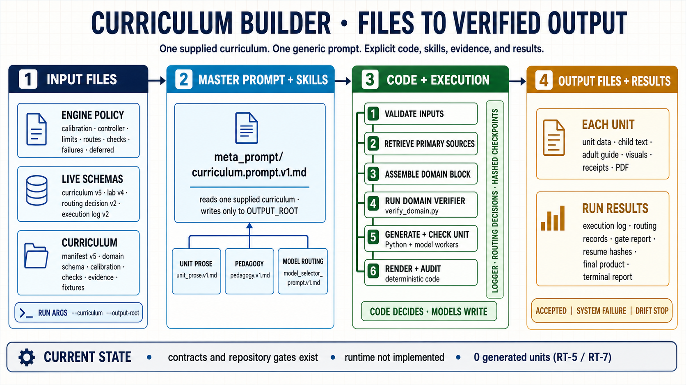

# How the curriculum pipeline works

This document describes the active contract in
`meta_prompt/curriculum.prompt.v1.md` and the repository state as of 2026-08-02.
It is orientation, not an executable requirement; the prompt, schemas, policy
manifests, and curriculum-owned contracts take precedence.

The previous generator-building design is preserved under `docs/deprecated/`.

## Visual overview



The editable production brief is
`docs/prompts/curriculum_pipeline_infographic.v2.prompt.md`. Earlier Typst and PNG
versions remain under `docs/deprecated/` and at their original paths for history.

---

## 1. Current status

The repository contains the curriculum contract, policy, schemas, curriculum-owned
domain rules, fixtures, and repository gate harness. It does **not** yet contain the
runtime controller, logger, renderer, source-fetching run, or live model route needed
to produce a unit.

That boundary is explicit:

- `policy/deferred.v1.yaml` `RT-5` records the missing runtime;
- `RT-7` records that zero units have been generated;
- phase 4 currently passes 30 repository gates and phase 5 passes 38, but those
  results validate the repository and its fixtures—not generated curriculum;
- generated units remain drafts pending downstream human review, even after every
  declared automated check passes.

The four superseded schemas were retired on 2026-08-02. Active contracts are
`curriculum.schema.v5.json`, `lab.schema.v4.json`,
`routing_decision.schema.v2.json`, and `execution_log.schema.v2.json`; their
predecessors are retained under `schemas/deprecated/`.

---

## 2. One prompt runs a supplied curriculum

The active design no longer builds a curriculum-specific generator.
`meta_prompt/curriculum.prompt.v1.md` directly governs a run:

```text
ENGINE + CURRICULUM + OUTPUT_ROOT
                 │
                 ▼
 meta_prompt/curriculum.prompt.v1.md
                 │
                 ├── reads engine policy and schemas
                 ├── reads one supplied curriculum and its domain verifier
                 └── writes only below OUTPUT_ROOT
```

The three boundaries are deliberate:

- `ENGINE` is derived from the prompt's own location and is immutable;
- `CURRICULUM` is required through `--curriculum`, lives below `curricula/`, and is
  immutable;
- `OUTPUT_ROOT` is required through `--output-root` and is the only write target.

If `OUTPUT_ROOT` already contains a run, startup fails before any artifact or model
call. The pipeline never merges, overwrites, or silently chooses a new version.

The prompt never names a curriculum, subject, or unit count. It reads the manifest,
asserts the declared IDs, and derives the run from them.

---

## 3. Engine rules and curriculum rules are separate

The current architecture makes the engine domain-neutral.

| Engine owns | Each curriculum owns |
|---|---|
| controller and terminal-state policy | manifest and ordered unit roster |
| engine-wide pedagogy and readability calibration | domain calibration and permitted inputs |
| generic unit schema: six blocks | schema for the seventh, `domain`, block |
| generic checks and model-routing policy | domain verifier and its accept/reject fixtures |
| logging, checkpoint, audit, and resource-limit contracts | curriculum-specific checks and evidence |

The active Arduino manifest is
`curricula/arduino_kit/arduino_kit_curriculum.v5.yaml`. Version 5 moved
electronics-only concepts out of the engine contract and into the curriculum's own
`domain` configuration. Its v4 predecessor remains in `curricula/deprecated/`.

An unrelated curriculum must be able to use the same prompt without changing a word
in `meta_prompt/`, `policy/`, or the engine schemas. This is structurally enforced,
but has not yet been demonstrated by a completed second-curriculum run (`RT-10`).

---

## 4. What a unit contains

`schemas/lab.schema.v4.json` requires seven blocks:

| Engine block | Purpose |
|---|---|
| `identity` | stable ID, title, and unit identity |
| `pedagogy` | objectives, scaffolding, vocabulary, and calibrated depth |
| `sequence` | ordered learning sequence, including Predict–Observe–Explain |
| `content` | learner and adult-facing material |
| `safety` | the generic safety floor and supervision requirements |
| `visuals` | roles, provenance, and resolvable receipts |
| `domain` | curriculum-owned facts validated by its own schema and verifier |

The engine understands the first six shapes. It deliberately does not understand the
subject matter inside `domain`.

For Arduino, that seventh block validates against
`curricula/arduino_kit/domain.schema.v1.json` and is checked by
`curricula/arduino_kit/verify_domain.py`. The verifier is deterministic and is proven
against the curriculum's declared positive and negative fixtures before generation.
Missing verifier or failing fixtures is a startup refusal.

---

## 5. One parent for every rendered fact

Every subject-matter fact has one parent: the unit's `domain` block. Prose, tables,
maps, diagrams, troubleshooting guidance, and adult checks name the pointer they were
derived from. `DOC-DERIVED-FROM-SOURCE` checks that the pointer resolves and that the
rendered value agrees.

Every domain value also requires primary-source grounding retrieved during the run.
The record carries the source identifier, access date, scope, and measurement
condition. A recalled value is not accepted as a substitute for a retrieved source.

Visual provenance is checked the same way: `RECEIPT-HASH-RESOLVES` recomputes the
asset hash from shipped bytes. A plausible image or an unresolvable receipt is not
evidence.

---

## 6. Per-unit execution

The active contract describes this compact flow:

```text
read declared unit
      ↓
retrieve primary sources
      ↓
assemble domain block → run curriculum's deterministic verifier
      ↓
generate six engine blocks from that domain block
      ↓
run generic deterministic checks
      ↓
run one cross-family judge
      ↓
record acceptance decision and checkpoint
```

Code owns order, state transitions, routing, retries, checkpoints, revision targeting,
audits, and acceptance. Models write bounded artifacts and never advance state or
approve their own unsupported technical claims.

The current review rule is **one judge per pass**, from a different model family than
the generator, using an explicit rubric and randomized presentation order. The older
four-plan-reviewer plus four-QA-reviewer design is historical and is preserved only in
`docs/deprecated/`.

---

## 7. Six runtime gates

The prompt requires these gates in order:

| # | Gate | What it proves |
|---|---|---|
| 0 | Logger | append-only records, monotonic IDs, paired starts/completions, safe concurrent appends, and operation coverage |
| 1 | Static | engine and curriculum manifests agree; every advertised check is either executed or truthfully mapped to a deferred obligation |
| 2 | Deterministic | transitions, checkpoints, limits, derivation, readability, taxonomy flags, receipts, audits, and all rejection fixtures |
| 3 | Simulated | fake workers exercise acceptance, revision, malformed output, retry, failure, legal block, interruption, and resume |
| 4 | Live capability | every declared external route succeeds under its exact recorded invocation |
| 5 | Golden unit | the first complete unit passes the domain verifier, generic checks, judge, render, page inspection, forced interruption/resume, and final audit |

Gate 0 passes before any non-logger artifact exists. A full-run command is written only
after all six gates earn it. Static or simulated coverage is never reported as
generated-unit coverage.

---

## 8. Routing and execution records

Routing policy lives under `policy/routing/`; external capability invocations live in
`policy/routes.v1.yaml`. They are related but not interchangeable.

Every future model call must first produce a routing decision valid against
`schemas/routing_decision.schema.v2.json`. It records both `decided_model` and
`executed_model`. The corresponding v2 execution-log action uses
`action_kind: model_call` and must carry that decision's ID.

The repository currently proves that these rules are stated, shaped, and detectable.
It does not yet enforce them at runtime because no controller or logger exists.
`RT-3`, `RT-4`, and `RT-5` preserve that distinction.

Deterministic tasks—validation, hashing, rendering, aggregation, auditing, and
logging—never use a model. Composition is serial by default; retrieval and analysis
may be parallelized.

---

## 9. Output, resume, and final claims

The run writes only below `OUTPUT_ROOT`. After every action it records inputs,
outputs, hashes, route information where applicable, elapsed time, and the next safe
state. `--resume` revalidates those checkpoints and restarts from the first missing or
invalid one without rewriting accepted work.

After every declared unit is accepted, the product is assembled, rendered, rasterized,
and inspected page by page. Completion requires every unit plus the final audited
product.

A report keeps three claims separate:

1. how many units were produced;
2. whether each produced unit passed every declared automated check;
3. that all produced units remain drafts pending downstream human review.

The active prompt's terminal outcomes are acceptance, system failure, and drift stop.
No report may claim a runtime success today: zero units have been generated.

---

## 10. Where to read next

- `meta_prompt/curriculum.prompt.v1.md` — active run contract
- `policy/controller.v1.yaml` — states, ownership, CLI, and terminal policy
- `policy/deferred.v1.yaml` — exact boundary between verified structure and missing runtime
- `schemas/lab.schema.v4.json` — generic seven-block unit contract
- `curricula/arduino_kit/arduino_kit_curriculum.v5.yaml` — current curriculum manifest
- `curricula/arduino_kit/domain.schema.v1.json` — Arduino domain shape
- `curricula/arduino_kit/verify_domain.py` — Arduino deterministic verifier
- `docs/deprecated/` — superseded v6 generator-building documentation, retained as history
