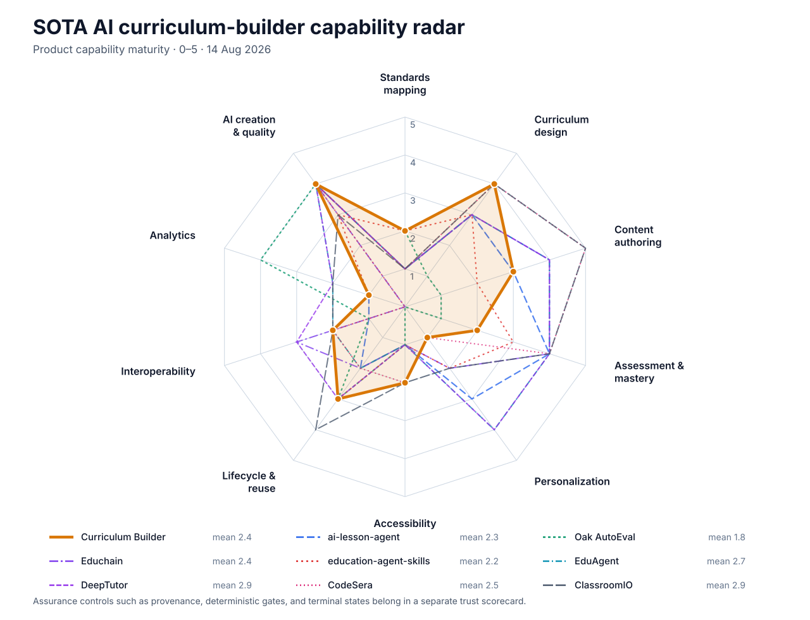

# SOTA Capability Radar: AI Curriculum Builders

Version: **v2**  
Date: **2026-08-14**  
Status: **Corrected product-capability comparison**

## Correction

The previous radar used assurance-architecture concerns such as terminal states,
provider governance, and evidence receipts as its axes. Those are valuable
non-functional controls, but they are not a recognizable curriculum-builder
capability model. This version separates that assurance layer from the product
capabilities that curriculum designers, learning-platform teams, and EdTech
buyers normally expect.

## How the capability model was derived

This taxonomy is synthesized from current, authoritative education-technology
standards and leading authoring-platform practice:

- [1EdTech CASE](https://www.1edtech.org/standards/case) defines digital exchange,
  tagging, and tracking of academic standards, competencies, learning outcomes,
  aligned resources, and mastery.
- [Quality Matters' Higher Education Rubric](https://www.qualitymatters.org/qa-resources/rubric-standards/higher-ed-rubric)
  treats alignment among objectives, assessment, instructional materials,
  learning activities, technology, learner support, and accessibility as the
  foundation of course design.
- [1EdTech QTI](https://www.1edtech.org/standards/qti/index) covers interoperable
  assessment items, tests, item banks, results, scoring, analytics, accommodations,
  and adaptive testing.
- [CAST UDL Guidelines 3.0](https://udlguidelines.cast.org/) define inclusive
  design through multiple means of engagement, representation, and action and
  expression.
- [Canvas Mastery Paths](https://community.instructure.com/en/kb/articles/660914-unknown)
  demonstrate performance-based differentiated assignments and conditional
  learning paths.
- [Open edX Content Libraries](https://docs.openedx.org/en/latest/educators/concepts/instructional_design/content_libraries.html)
  demonstrate modular authoring, reuse, roles, local overrides, version updates,
  and controlled synchronization across courses.
- [Open edX's current authoring direction](https://docs.openedx.org/en/latest/community/release_notes/teak/teak_marketing_notes.html)
  includes in-context learning analytics, learner preview, reusable course
  structures, LTI integration, and granular content-library roles.
- [1EdTech Common Cartridge, CASE, QTI, LTI, and Caliper](https://www.1edtech.org/specifications)
  establish the interoperability and learning-data layer expected in a modern
  education ecosystem.
- [1EdTech AI-Generated Content Best Practices](https://www.imsglobal.org/resource/AI-Generated_Content_Best_Practices/v1p0)
  add AI disclosure, human/SME oversight, accessibility review, provenance,
  versioning, and portable metadata; [UNESCO's GenAI guidance](https://www.unesco.org/en/articles/guidance-generative-ai-education-and-research)
  adds human-centred, age-appropriate, safe, equitable, and pedagogically
  meaningful use.

## SOTA curriculum-builder capabilities

| Capability | What a modern curriculum builder should do |
|---|---|
| **1. Standards and competency mapping** | Import or define standards, competencies, and outcomes; tag curriculum elements to them; expose coverage and gap maps; and track mastery against stable identifiers. |
| **2. Curriculum design and sequencing** | Build programs, courses, modules, units, and lessons; align objectives, prerequisites, activities, and resources; manage pacing and coherent progression. |
| **3. Content and activity authoring** | Create and edit learner and teacher content across text, media, interactive activities, projects, labs, and multiple delivery formats. |
| **4. Assessment and mastery** | Author formative and summative assessments, rubrics, item banks, feedback, scoring, accommodations, and objective/competency mastery evidence. |
| **5. Differentiation and adaptive pathways** | Produce variants for learner needs and language/reading levels; define conditional paths; personalize content, supports, challenge, and remediation from performance. |
| **6. Accessibility and inclusive design** | Apply UDL and accessibility requirements across representation, interaction, expression, navigation, alt text, captions, readability, and assistive technology. |
| **7. Content lifecycle, reuse, and collaboration** | Maintain reusable libraries, metadata, roles, version history, review/approval, local overrides, update previews, synchronization, and safe publishing. |
| **8. Interoperability and delivery** | Exchange curriculum, assessments, outcomes, metadata, and tools through standards such as CASE, Common Cartridge, QTI, and LTI; publish to LMS, web, and document channels. |
| **9. Analytics and continuous improvement** | Measure engagement, activity, item performance, outcome mastery, and content effectiveness; identify gaps and feed evidence back into curriculum revision. |
| **10. AI-assisted creation and quality** | Assist planning, research, drafting, differentiation, assessment, media, review, and revision while preserving human control, disclosure, accessibility, and subject-matter validation. |

## Scoring rubric

Scores describe **documented product-capability maturity**, not repository
quality, popularity, or assurance architecture:

| Score | Meaning |
|---:|---|
| 0 | No evidence of the capability. |
| 1 | Rudimentary, indirect, or incidental support. |
| 2 | Limited but identifiable support. |
| 3 | Functional capability with meaningful coverage. |
| 4 | Strong, integrated capability. |
| 5 | Comprehensive, standards-oriented, or state-of-the-art capability. |

The external scores remain bounded by the README-level evidence summarized in
[`github_ai_curriculum_factory_landscape.v1.md`](github_ai_curriculum_factory_landscape.v1.md).
Absence from that evidence is scored conservatively; it is not proof of absence
from the source code.

## Corrected radar

| Project | Standards mapping | Curriculum design | Content authoring | Assessment | Personalization | Accessibility | Lifecycle and reuse | Interoperability | Analytics | AI creation and quality | Mean |
|---|---:|---:|---:|---:|---:|---:|---:|---:|---:|---:|---:|
| **Curriculum Builder** | **2** | **4** | **3** | **2** | **1** | **2** | **3** | **2** | **1** | **4** | **2.4** |
| ai-lesson-agent | 1 | 3 | 3 | 4 | 3 | 1 | 2 | 1 | 1 | 4 | 2.3 |
| Oak AutoEval | 2 | 1 | 1 | 1 | 0 | 1 | 3 | 1 | 4 | 4 | 1.8 |
| Educhain | 1 | 3 | 4 | 4 | 2 | 1 | 2 | 3 | 0 | 4 | 2.4 |
| education-agent-skills | 2 | 3 | 2 | 3 | 2 | 1 | 3 | 2 | 1 | 3 | 2.2 |
| EduAgent | 1 | 3 | 4 | 4 | 4 | 1 | 2 | 2 | 2 | 4 | 2.7 |
| DeepTutor | 1 | 3 | 4 | 4 | 4 | 1 | 3 | 3 | 2 | 4 | 2.9 |
| CodeSera | 1 | 4 | 5 | 4 | 1 | 2 | 2 | 2 | 0 | 4 | 2.5 |
| ClassroomIO | 1 | 4 | 5 | 4 | 2 | 2 | 4 | 2 | 2 | 3 | 2.9 |

The mean is directional only. Oak AutoEval and `education-agent-skills`, for
example, are specialized layers rather than complete curriculum-building products.

## What the corrected radar says

### Where Curriculum Builder is strong

- **Curriculum design and sequencing (4):** manifest-defined scope, ordered
  curriculum production, unit structure, objectives, learning sequences, and
  curriculum-owned domain rules are central to the repository.
- **AI-assisted creation and quality (4):** the runtime covers research,
  structured domain generation, content writing, visuals, review, repair, and
  workbook assembly with explicit author/reviewer roles.
- **Content lifecycle and reuse (3):** the engine/curriculum separation,
  versioned contracts, immutable inputs, retained attempts, and review states
  provide a credible lifecycle base, although there is no collaborative content
  library or authoring workspace comparable to current LMS platforms.
- **Content authoring (3):** the system can attempt units, visuals, and a
  workbook, but the score is capped because the prior learner-facing documents
  failed and the corrected live release has not completed.

### Where Curriculum Builder is behind the market

- **Personalization (1):** no learner model, differentiated variants,
  performance-triggered paths, or adaptive remediation comparable to Canvas,
  EduAgent, or DeepTutor is established.
- **Analytics (1):** execution telemetry and QA evidence are not learning
  analytics. The system does not measure engagement, mastery, item performance,
  or instructional effectiveness.
- **Standards mapping (2):** curriculum manifests and objectives exist, but
  there is no conventional CASE-style standards ingestion, stable standards
  identifiers, coverage map, crosswalk, or mastery tracking.
- **Assessment and mastery (2):** activities and checks exist, but no complete
  assessment-authoring subsystem, reusable item bank, rubric engine, scoring
  model, or outcome mastery record is established.
- **Accessibility (2):** readability and rendered inspection are valuable, but
  they are not a complete UDL/WCAG workflow covering multiple representations,
  captions, alt text validation, keyboard/assistive technology, and learner
  preferences.
- **Interoperability (2):** PDF/workbook delivery is supported conceptually, but
  CASE, Common Cartridge, QTI, LTI, SCORM/xAPI, and direct LMS publishing are not
  established.

## Bottom line

On recognizable curriculum-builder product capabilities, this repository is
**mid-pack, not the leader**. Its directional mean is **2.4**, tied with Educhain,
behind DeepTutor and ClassroomIO (**2.9**), EduAgent (**2.7**), and CodeSera
(**2.5**). It narrowly exceeds `ai-lesson-agent` (**2.3**) because of broader
curriculum design and lifecycle scope, not because it offers a more complete
learner or authoring product.

The repository's real differentiation remains important, but it belongs in a
separate **assurance and trust scorecard**: deterministic validation, evidence
lineage, independent review, rendered QA, fail-closed release, and provider
control. Those controls can make this a more trustworthy factory; they do not,
by themselves, make it a more capable curriculum builder.

## Product roadmap implied by the gaps

1. Add CASE-style standards/competency import, stable identifiers, alignment,
   crosswalks, and coverage reporting.
2. Build an assessment domain with item banks, rubrics, formative/summative
   modes, feedback, mastery evidence, and QTI exchange.
3. Add differentiated variants and performance-driven pathways without forcing
   the factory to become a full learner-facing LMS.
4. Turn UDL/WCAG accessibility into a first-class authoring and acceptance
   workflow, including accurate alt text, captions, navigation, and assistive-
   technology checks.
5. Add reusable content libraries with metadata, roles, branching/overrides,
   review, and update synchronization.
6. Support Common Cartridge/QTI/LTI plus direct LMS publishing; retain PDF and
   workbook as delivery channels, not the entire interoperability strategy.
7. Add standards-aligned learning analytics and an evidence-to-revision loop
   using outcome coverage, assessment/item performance, and learner engagement.
8. Provide a human authoring surface for preview, edit, approve, compare, and
   publish rather than exposing only a production runtime.

## Evidence boundary and limitations

- The SOTA taxonomy is grounded in current standards and platform documentation;
  project scoring is still based on the focused GitHub landscape, not a new
  line-by-line audit of every candidate.
- The model intentionally measures curriculum-building product capabilities.
  It excludes deployment scale, community size, commercial support, cost,
  latency, privacy/security, and general LMS administration.
- Assurance controls should be assessed separately and used as release gates,
  not mixed into the product-capability radar.
