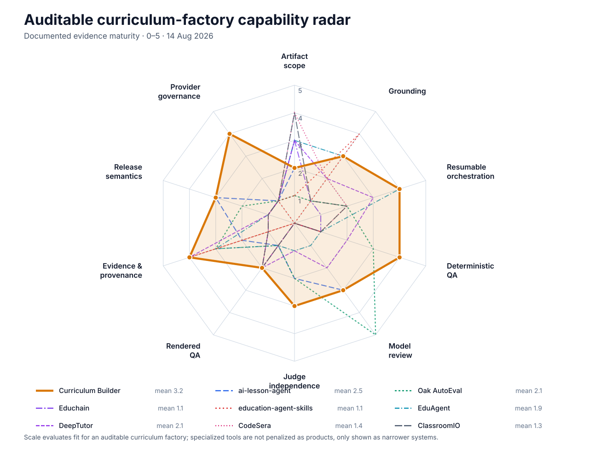

# Capability Radar: Auditable AI Curriculum Factories

Version: **v1**  
Date: **2026-08-14**  
Status: **SUPERSEDED — incorrect product-capability taxonomy**

This comparison mixed assurance controls with curriculum-builder product
capabilities. Use the corrected, standards-grounded
[`github_ai_curriculum_builder_sota_capability_radar.v2.md`](github_ai_curriculum_builder_sota_capability_radar.v2.md)
instead.

## Question answered

How does this Curriculum Builder compare with the eight projects reviewed in
[`github_ai_curriculum_factory_landscape.v1.md`](github_ai_curriculum_factory_landscape.v1.md)
when they are measured as **auditable curriculum factories**, rather than as
generic education products?

## Capability definitions

| Capability | Definition |
|---|---|
| Artifact scope | Breadth and completeness of generated instructional artifacts, including multi-unit or curriculum-wide assembly. |
| Grounding | Binding outputs to a curriculum/manifest and to retrievable sources, with support traceable to the claims or facts used. |
| Resumable orchestration | Explicit workflow state, checkpoints, interrupts, bounded retries, and safe continuation after interruption. |
| Deterministic QA | Schemas and programmatic checks that can reject malformed, incomplete, unsafe, or inconsistent artifacts without relying on a model. |
| Model review | Qualitative model-based evaluation against an explicit instructional, factual, or pedagogical rubric. |
| Judge independence | Structural separation between author and judge, ideally including a different model family and prevention of self-approval. |
| Rendered QA | Inspection of the actual learner-facing HTML/PDF/workbook or rasterized pages, not merely successful export or source-data validation. |
| Evidence and provenance | Retained intermediates, receipts, hashes, source records, execution lineage, and inspectable review evidence. |
| Release semantics | Fail-closed acceptance, explicit completion denominators, bounded repair, and truthful run-level terminal states. |
| Provider governance | Explicit routing, authentication, executed-model identity, credential policy, and control of fallbacks or disallowed providers. |

## Scoring rubric

Scores measure **documented evidence maturity**, not overall product quality:

| Score | Meaning |
|---:|---|
| 0 | No capability established by the reviewed evidence. |
| 1 | Mentioned, incidental, or only indirectly present. |
| 2 | Narrow implementation or output exists, but it is not governed or release-proven. |
| 3 | Substantive capability exists, with meaningful but incomplete control or proof. |
| 4 | Governed and tested implementation is established. |
| 5 | Live, end-to-end, release-level proof is established. |

For the eight external projects, the evidence boundary is their repository
documentation as summarized in the landscape note. A low score therefore means
“not established by this research pass,” not “proved absent from the code.” For
the local Curriculum Builder, the score also considers current runtime code,
Run 27 results, and the reproduced failures from `arduino_kit_run_v2`.

## Radar data

| Project | Scope | Grounding | Orchestration | Deterministic QA | Model review | Judge independence | Rendered QA | Provenance | Release semantics | Provider governance | Mean |
|---|---:|---:|---:|---:|---:|---:|---:|---:|---:|---:|---:|
| **Curriculum Builder** | **2** | **3** | **4** | **4** | **3** | **3** | **2** | **4** | **3** | **4** | **3.2** |
| ai-lesson-agent | 2 | 3 | 4 | 4 | 3 | 2 | 1 | 2 | 3 | 1 | 2.5 |
| Oak AutoEval | 1 | 1 | 2 | 3 | 5 | 2 | 1 | 3 | 2 | 1 | 2.1 |
| Educhain | 3 | 1 | 1 | 1 | 0 | 0 | 2 | 1 | 1 | 1 | 1.1 |
| education-agent-skills | 1 | 4 | 0 | 1 | 0 | 0 | 0 | 4 | 0 | 1 | 1.1 |
| EduAgent | 3 | 3 | 4 | 1 | 1 | 1 | 1 | 3 | 1 | 1 | 1.9 |
| DeepTutor | 3 | 2 | 3 | 2 | 2 | 1 | 2 | 4 | 1 | 1 | 2.1 |
| CodeSera | 4 | 2 | 2 | 1 | 0 | 0 | 2 | 1 | 1 | 1 | 1.4 |
| ClassroomIO | 4 | 1 | 2 | 1 | 0 | 0 | 2 | 1 | 1 | 1 | 1.3 |

The mean is only an orientation aid. Specialized layers such as Oak AutoEval
and `education-agent-skills` are intentionally strong on a few axes and are not
trying to be complete curriculum factories.

## Capability readout by project

- **Curriculum Builder** has the broadest assurance architecture: manifest and
  domain contracts, a real LangGraph runtime, resumable state, deterministic
  gates, cross-family review policy, append-only/hash-bound evidence, governed
  subscription routes, workbook topology, and explicit activation terminals.
  Its score is capped because release proof is incomplete: Run 27 has passed
  N00 through N60, but N70 has no admitted result and N80/N90 results do not yet
  exist. The prior four-unit run also accepted unreadable PDFs, false or
  irrelevant visuals, weak claim support, and no honest 4-of-35 terminal.
- **ai-lesson-agent** is the closest orchestration peer. It is especially strong
  in checkpointing, human interruption, deterministic-before-model checks,
  bounded regeneration, and structural role isolation, but its product boundary
  is a single-source interactive lesson rather than a released curriculum.
- **Oak AutoEval** is the strongest qualitative evaluation layer. It provides
  datasets, lesson-oriented tests, batch judge runs, and inspectable results,
  but does not own generation, rendering, provenance, or curriculum release.
- **Educhain** provides a reusable content-generation API across lesson plans,
  questions, flashcards, and notes, with common exports. It does not document a
  production control plane or acceptance system.
- **education-agent-skills** is the strongest pedagogy knowledge/provenance
  layer: research citations, evidence-strength labels, explicit exclusions, and
  composable practices. It is not an execution or publishing system.
- **EduAgent** combines LangGraph, RAG citations, adaptive plans, quizzes,
  flashcards, mind maps, and persisted learner state. It is a mature tutoring
  application shape, not a teacher-facing release pipeline.
- **DeepTutor** is strongest among the remaining projects in retained
  intermediates and inspectable outputs. Its validation is narrow and lacks
  rejection/release semantics.
- **CodeSera** is one of the strongest generators by artifact scope, producing
  multi-lesson HTML courses with activities and navigation, but documents very
  little assurance or provenance.
- **ClassroomIO** is strongest in downstream LMS authoring and delivery scope.
  It does not document curriculum-factory evidence, independent review, or
  fail-closed release controls.

## Bottom line

This repository is the strongest reviewed **architecture for an auditable
curriculum factory**, with a directional mean of 3.2 versus 2.5 for the closest
peer. Its advantage is breadth across controls that other projects implement as
separate layers: orchestration, deterministic validation, evidence lineage,
release semantics, and provider governance.

It is not yet the strongest demonstrated curriculum product. The weakest local
axes are artifact scope and rendered QA because no curriculum-wide release has
passed the current control plane, the prior shipped PDFs were unusable, and the
current Run 27 live-unit/workbook/final-audit sequence is unfinished. The honest
position is therefore: **assurance-design leader; implementation substantially
tested; end-to-end product release not yet proven**.

The shortest path to converting that architectural lead into a demonstrated
lead is to:

1. complete and admit N70, N80, and N90 under Run 27;
2. make claim-level source entailment a gate rather than treating hashes as
   support;
3. reject the actual rendered pages when learner content, visuals, or safety
   rules are missing or unreadable; and
4. complete a manifest-denominated curriculum run with a truthful terminal and
   independently inspectable release evidence.

## Local evidence used to cap the score

- [`implementation.graph.v7.yaml`](../../../plans/27_langgraph_curriculum_factory_remediation/execution_package_v2/implementation.graph.v7.yaml)
  defines the active remediation gates and terminals.
- [`N60_ADVERSARIAL_REGRESSION.result.v1.json`](../../../plans/27_langgraph_curriculum_factory_remediation/execution_package_v2/results/v7/N60_ADVERSARIAL_REGRESSION.result.v1.json)
  establishes that N00–N60 reached admitted `PASSED` results and records the
  current regression denominator.
- [`issues/README.md`](../../../issues/README.md) records the reproduced P0/P1
  failures in the prior four-unit run.
- `outputs/run27/live_unit/` currently contains an interrupted checkpointed run,
  but no admitted N70 result; no N80 or N90 result exists in the active v7
  result namespace as of this comparison.

## Limitations

- Radar scores compress qualitatively different capabilities into one ordinal
  scale and should not be treated as precise measurements.
- The categories are deliberately aligned to the research question of an
  auditable curriculum factory; they do not measure LMS breadth, learner UX,
  adoption, cost, latency, or community health.
- External scores inherit the landscape scan's README-level evidence boundary.
- The local `readme.md` and `docs/how_it_works.md` still describe the
  pre-runtime state and are stale relative to the Run 26/27 implementation.
